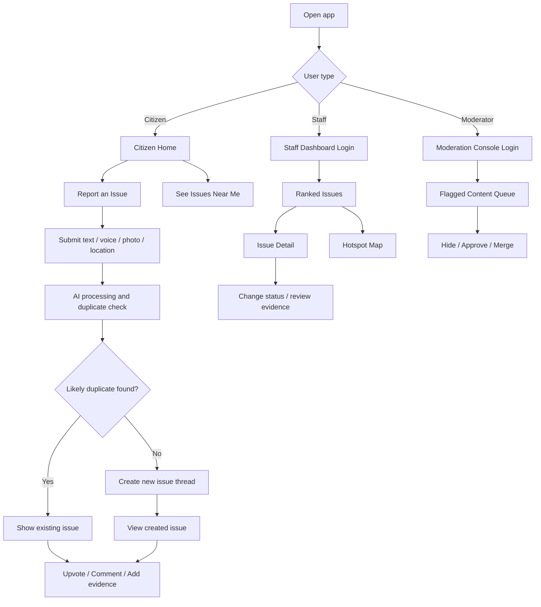
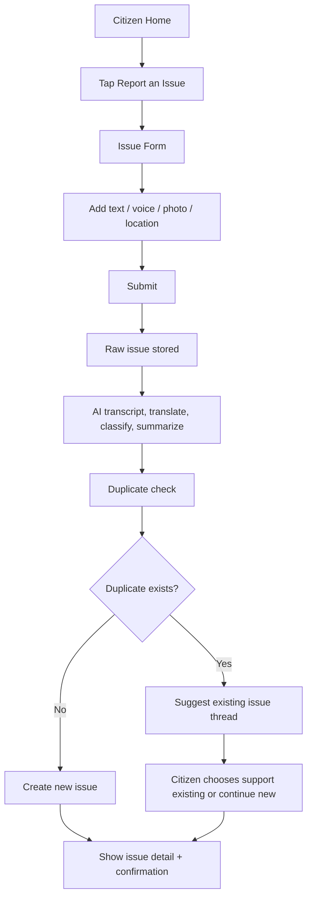
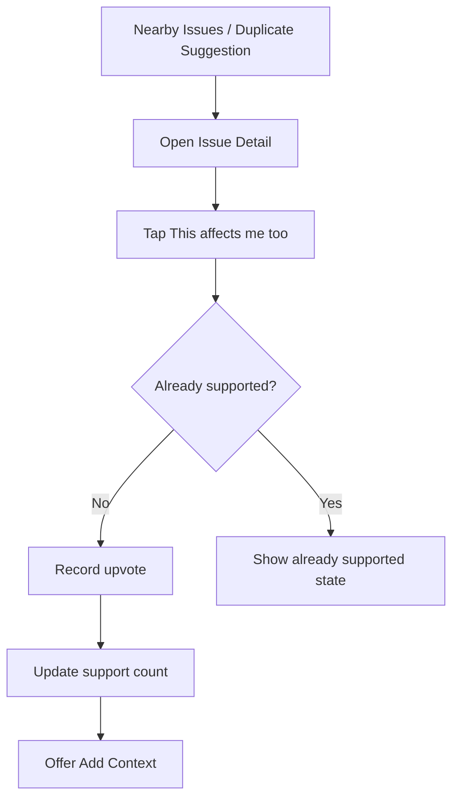
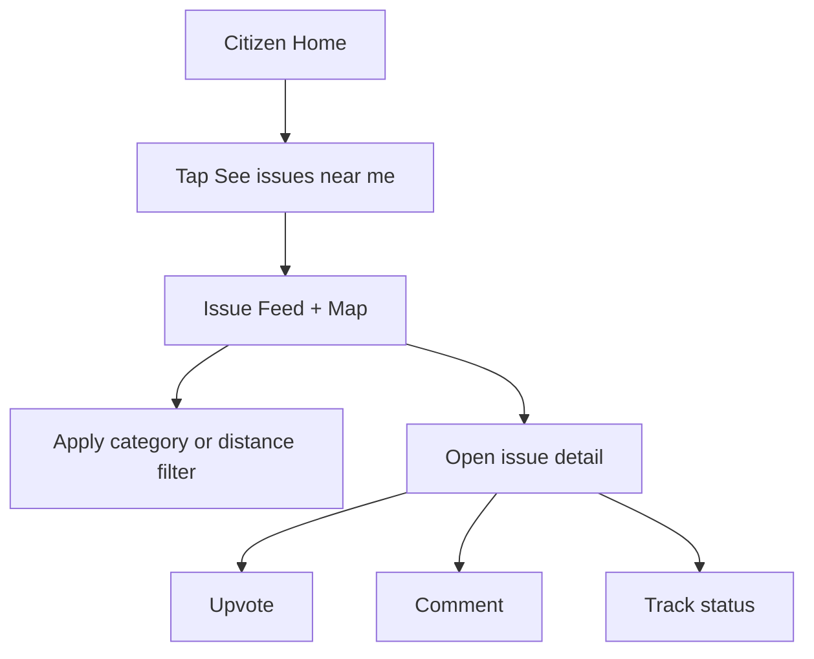
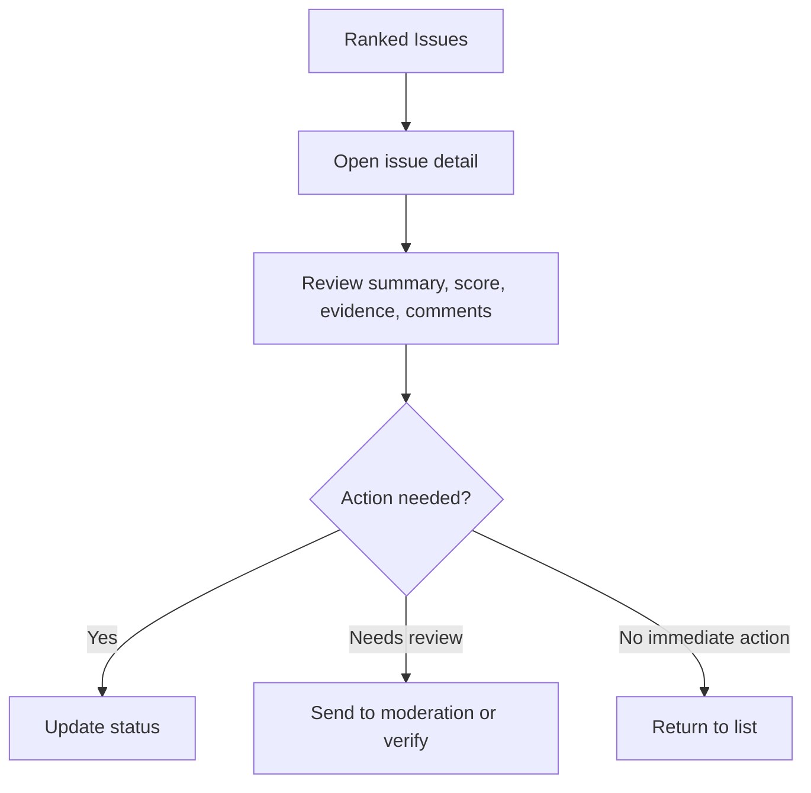
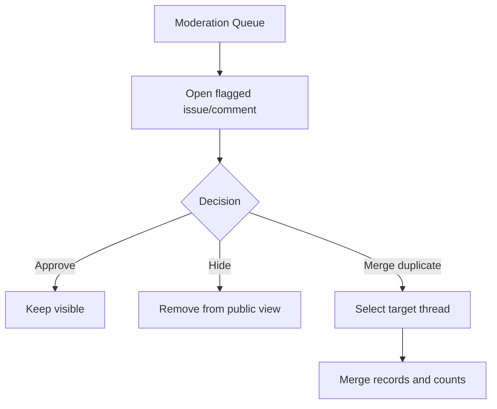

# App Flow — People's Priorities AI

## Purpose
This document defines the app flow for **People's Priorities AI**, the Track 1 civic-tech product for Build with AI: Code for Communities. It is written for fast product design and vibe coding, so it focuses on the main user goals, key screens, decision points, edge cases, and the shortest buildable paths first.[cite:55][cite:57][cite:60]

## App Flow Rules Used
This app flow follows current UX guidance for user-flow design: start from user goals, define entry points, map the core steps first, include decision points and outcomes, keep flows intuitive, reduce unnecessary steps, consider multiple scenarios, and design for accessibility and inclusivity from the start.[cite:55][cite:57][cite:60][cite:63]

For vibe coding, the flow should also be specific, lightweight, and implementation-friendly: one primary path per core task, optional branches only where needed, clear naming for screens and actions, and enough detail that a builder can turn the flow directly into routes, components, and API calls.[cite:58][cite:60][cite:65]

## Product Goal
The product helps citizens report local development issues and helps MP office staff identify the most important constituency needs. The system should reduce duplicate complaints, support multilingual and voice-first reporting, and turn community demand into a ranked issue list through upvotes, comments, AI enrichment, and public-data-backed prioritization.[cite:12]

## Primary User Goals
### Citizen goals
- Report a local issue quickly.
- Support an existing issue instead of repeating it.
- Add more context with comments, voice, or photos.
- See that the issue is visible and progressing.

### Staff goals
- See the most important issues first.
- Understand why an issue is ranked highly.
- Review issue evidence and community context.
- Update issue status for follow-up.

### Moderator goals
- Detect spam or abuse.
- Merge duplicates if AI misses them.
- Keep the issue list credible and usable.

## Flow Design Principles
- Start with the fewest screens needed to complete the main task.[cite:57][cite:60]
- Keep the citizen home screen focused on two actions only: **Report an issue** and **See issues near me**.[cite:57][cite:62]
- Use decision points only when they change the next step in a meaningful way.[cite:60][cite:65]
- Redirect duplicate issue creation into the existing issue thread whenever possible.[cite:57][cite:63]
- Make accessibility part of the flow, not a later patch, by supporting voice, low-text UI, large actions, and simple language.[cite:60][cite:63]
- Keep the main path obvious and push optional branches like filters, media attachments, and advanced context one step later.[cite:55][cite:57][cite:58]

## Flow Legend
- **Screen**: visible page/view in the app.
- **Action**: user interaction.
- **Decision**: branch point that changes the route.
- **System event**: backend or AI step.
- **Fallback**: error or alternate path.

## App Structure
The product has three main app zones:
1. **Citizen App** — report, browse, upvote, comment.
2. **Staff Dashboard** — ranked issues, map hotspots, issue details, action status.
3. **Moderation Console** — flagged items, duplicate merge, content controls.

## Top-Level Navigation
### Citizen app navigation
- Home
- Report Issue
- Nearby Issues
- Issue Detail
- My Activity (optional in MVP)

### Staff dashboard navigation
- Overview
- Ranked Issues
- Hotspot Map
- Moderation
- Settings / Scoring (optional in MVP)

## Core Flow Map

## Citizen Flow 1 — First-Time Entry
This flow must be as short as possible because first-time clarity strongly affects usability.[cite:57][cite:60]

### Goal
Help a citizen understand the app within seconds.

### Flow
1. User opens the app.
2. App shows a simple landing screen with two actions:
   - **Report an issue**
   - **See issues near me**
3. App optionally asks for location permission or location selection.
4. User continues into either submission or browsing.

### Screen requirements
**Citizen Home**
- Short headline: “Raise or support local issues.”
- Two primary buttons only.
- Language toggle.
- Voice-friendly visual cue.
- Minimal text.

### Notes for vibe coding
This screen should be implemented first because it defines the route structure and overall tone of the app.

## Citizen Flow 2 — Report a New Issue
This is the main happy-path flow for new issue creation.

### Required screens
#### Issue Form
Fields:
- Text description
- Voice upload / record
- Photo upload
- Location input or map pin
- Category prompt (optional shortcut)
- Language picker / auto-detect

#### Processing State
- “Analyzing your issue…”
- Show progress or staged steps if possible.
- Keep it short.

#### Duplicate Suggestion Screen
- Show similar issue summary.
- Show support count.
- Offer 2 choices:
  - **This is my issue too**
  - **Create a new issue anyway**

#### Issue Confirmation Screen
- Show summary.
- Show next actions: support, comment, share, track.

### UX rules
- Keep the form short and progressive.[cite:57][cite:60]
- Attachments should be optional so the core task remains fast.[cite:58][cite:65]
- Duplicate check must happen before final publish to reduce clutter.

## Citizen Flow 3 — Support an Existing Issue
This is the differentiator flow and should be extremely smooth.

### Goal
Let users contribute to an existing issue in one tap instead of re-reporting.

### Issue Detail requirements
- Summary
- Photo or visual proof if available
- Location
- Support count
- Comment count
- Status badge
- Primary CTA: **This affects me too**
- Secondary CTA: **Add context**

### UX rules
- Upvote must be one tap after opening the issue.
- Support count should update immediately or near-real-time.
- Copy should feel civic, not social-media-like.

## Citizen Flow 4 — Add Context via Comment
Comments should capture useful field context, not casual chat.

### Goal
Let users add clarifying evidence without cluttering the main issue summary.

### Flow
1. User opens issue detail.
2. User taps **Add context**.
3. User enters text or uploads voice/image.
4. User submits.
5. System stores the comment and optionally runs AI extraction.
6. Comment appears in thread.

### Comment composer requirements
- Text area
- Voice note upload
- Image upload
- Placeholder examples such as “When does this happen?” or “Who is affected?”

### AI/system behavior
- Extract concise insight from comment.
- Add signals to issue urgency or context if relevant.
- Flag abuse if needed.

## Citizen Flow 5 — Browse Nearby Issues
This flow reduces duplicate reporting and increases discovery.

### Nearby Issues screen requirements
- List + map toggle or split view.
- Cards with summary, area, support count, status.
- Search and category filter.
- Empty state if no issues nearby.

### UX rules
- Default to nearby/high-support issues first.
- Filters should be optional and not block first interaction.[cite:57][cite:60]
- Supporting an issue should always be faster than creating a new one.[cite:58][cite:63]

## Citizen Flow 6 — Track Issue Status
This can be light in MVP but improves trust.

### Goal
Let users see whether the issue is open, under review, planned, in progress, or resolved.

### Flow
1. User opens issue detail.
2. User sees current status.
3. Optional: user checks timeline/events.
4. Optional: user gets notification or sees update banner.

### Status model
- Open
- Under Review
- Planned
- In Progress
- Resolved

## Staff Flow 1 — Dashboard Entry
The staff flow must prioritize fast understanding over exploration.

### Goal
Help staff see the highest-priority issues immediately.

### Flow
1. Staff logs in.
2. Dashboard opens on ranked issues overview.
3. Top KPIs appear first.
4. Staff scans list or map.
5. Staff opens issue detail.

### Overview screen requirements
- Top open issues count
- Rising issue count
- Top categories
- Ranked issue list
- Hotspot map snapshot

## Staff Flow 2 — Review Ranked Issue

### Issue detail panel requirements
- AI summary
- Original user content
- Category
- Location
- Support trend
- Comment highlights
- Photos / voice assets
- Priority score breakdown
- Status update control

### Priority score display
The score should be broken into understandable factors:
- Community demand
- Infrastructure gap
- AI urgency
- Vulnerability
- Recency

## Staff Flow 3 — Hotspot Exploration
### Goal
Let staff understand where problems cluster geographically.

### Flow
1. Staff opens hotspot map.
2. Staff filters by category/time.
3. Staff clicks map marker or region.
4. Related issues list updates.
5. Staff opens issue detail.

### Screen requirements
- Heatmap or clustered markers
- Category filter
- Time filter
- Linked list panel
- Quick-open issue action

## Moderator Flow — Flag, Review, Merge
Moderation should be a focused flow, not a complex admin maze.

### Moderation requirements
- Queue view
- Reason for flag
- Issue/comment preview
- Merge duplicate action
- Audit trail entry

## Edge Cases and Alternate Paths
Best-practice app flows include multiple scenarios and alternate outcomes instead of only the happy path.[cite:60][cite:63][cite:65]

### Case 1 — Duplicate check fails
- User can still publish a new issue.
- System marks issue for later review.

### Case 2 — Voice transcription fails
- Raw voice submission remains stored.
- User sees “processing delayed” or “text not available yet.”

### Case 3 — User already upvoted
- Button becomes disabled or changes to supported state.
- No duplicate count increment.

### Case 4 — No nearby issues found
- Show clear empty state.
- Offer **Report the first issue in this area**.

### Case 5 — Media upload fails
- Continue with text-only submission if possible.

### Case 6 — Staff sees low-confidence duplicate cluster
- Send to moderation review.

## Recommended Route Map
### Citizen routes
- `/`
- `/report`
- `/issues`
- `/issues/:id`
- `/submit/processing`
- `/submit/duplicate`
- `/submit/complete`

### Staff routes
- `/dashboard`
- `/dashboard/issues`
- `/dashboard/issues/:id`
- `/dashboard/map`
- `/dashboard/moderation`

## Screen Inventory
### Citizen screens
1. Home
2. Report Issue Form
3. Processing
4. Duplicate Suggestion
5. Issue Created Confirmation
6. Nearby Issues Feed
7. Issue Detail
8. Comment Composer

### Staff screens
1. Dashboard Overview
2. Ranked Issues List
3. Issue Detail Panel/Page
4. Hotspot Map
5. Moderation Queue

## Build Order for Vibe Coding
Good user-flow practice starts with the main task first and expands later.[cite:57][cite:60] For this product, build in this order:

### Phase 1 — Core citizen path
- Home
- Report form
- Issue creation
- Issue detail

### Phase 2 — Community validation
- Duplicate suggestion
- Upvote flow
- Comment flow
- Nearby issues list

### Phase 3 — Staff path
- Dashboard overview
- Ranked issue list
- Issue detail
- Status updates

### Phase 4 — Intelligence and polish
- Hotspot map
- Score breakdown
- Moderation queue
- Error and empty states

## Click-Depth Targets
To keep the UX efficient and intuitive, the main tasks should stay short.[cite:57][cite:60][cite:62]

| Task | Target clicks/taps |
|---|---|
| Start reporting | 1 |
| Submit issue | 3–5 |
| Support existing issue | 1–2 from issue detail |
| Add comment | 2–3 |
| Staff open top issue | 1 |
| Staff change issue status | 2 |

## What to Prototype First
For a hackathon prototype, the must-demo sequence is:
1. Open app.
2. Tap **Report an issue**.
3. Submit voice/text issue.
4. Hit duplicate suggestion.
5. Tap **This affects me too**.
6. Add comment.
7. Open staff dashboard.
8. See updated issue ranking and score explanation.

## Final Flow Recommendation
The strongest app flow for this project is not a long reporting journey. It is a **short citizen reporting flow + even shorter support flow + clear staff review flow**. That structure follows user-flow best practice because it starts from the main user goal, minimizes friction, covers alternate outcomes, and keeps the primary paths simple enough to design and build quickly.[cite:55][cite:57][cite:60][cite:63]
